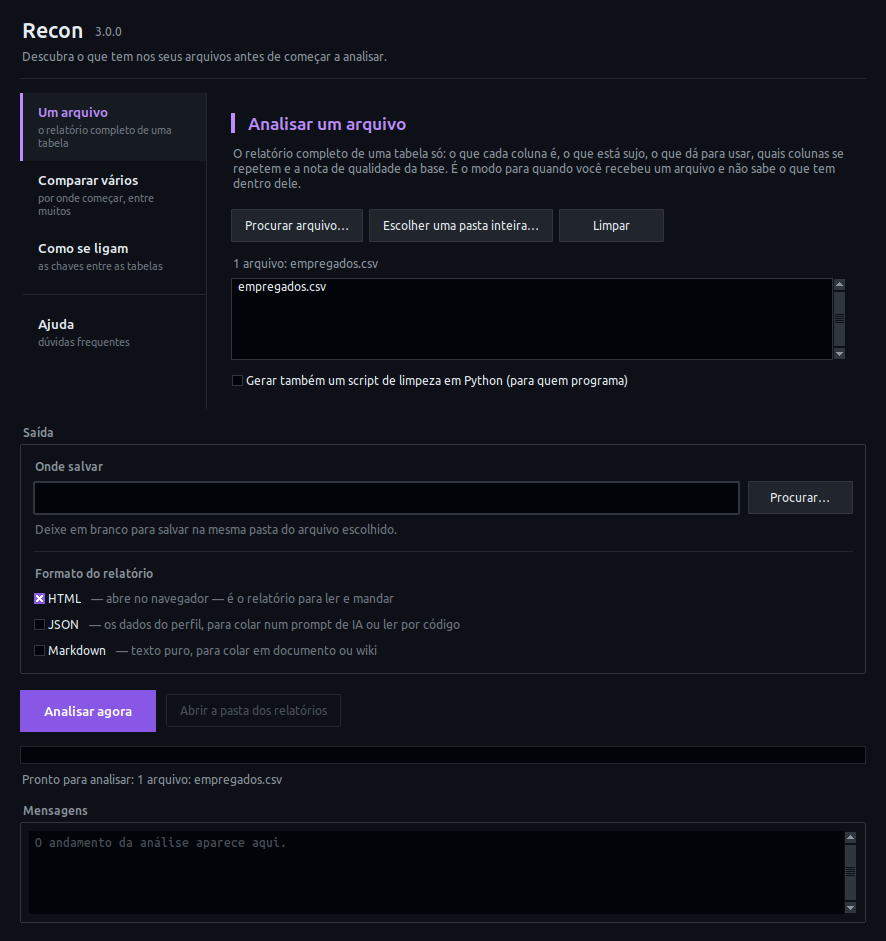

# 🔭 Recon

**A ferramenta que você roda *antes* de começar a análise de verdade.**

Você recebeu um arquivo — ou cinco — que nunca viu. O Recon perfila cada tabela (o que é lixo, o que é data, o que é chave, o que dá pra usar), descobre **como as tabelas se ligam entre si**, identifica quais são fato e quais são dimensão, e devolve **análises sugeridas com o código pronto pra rodar**. A ideia é chegar no trabalho real já com metade do caminho andado, em vez de gastar meio dia entendendo o dado.

Roda em CSV, XLSX, XLS e XLSB. Sem banco de dados, sem serviço externo, sem modelo de IA — só Python e as bibliotecas do `pyproject.toml`, instaláveis com `pip install --user` em máquina corporativa. Saída em **JSON** (pra colar num prompt ou consumir via código), **Markdown** e **HTML** (pra ler) e **Parquet** (pra BI).

---

## ✨ O que ele faz

| Análise | Descrição |
|---|---|
| 🧠 **Inferência semântica** | Cascata de evidências: dicionário, reconstrução de abreviatura (`cd_dpto_lot`), gazetteers de conteúdo (uma coluna `f27` com siglas de UF é geográfica), assinatura estrutural e contexto da tabela. Separa **papel** (o que a coluna é) de **domínio** (sobre o que ela fala), e devolve **hipóteses ranqueadas** quando não tem certeza |
| 📊 **Estatística descritiva** | Min/max/média/mediana/desvio, outliers robustos a assimetria, distribuição de frequência, tipo de dado real |
| 🔬 **Testes de hipótese** | Shapiro-Wilk com tamanho de efeito, qui-quadrado com V de Cramér, IC 95%, seleção de distribuição por AIC, ADF e Ljung-Box sobre série agregada |
| 🧹 **Sujeira de dados** | Nulos disfarçados (`N/A`, `-`, `#N/D`, `-1`, `999999`), grafias divergentes (`SP`/`sp`/`S.P.`), mojibake de encoding, documento com dígito verificador inválido |
| 🔗 **Relações entre colunas** | Dependências funcionais, equivalências 1:1, colunas idênticas **e quase idênticas** (o mesmo campo vindo de dois sistemas), chaves compostas candidatas |
| 📈 **Correlação** | Pearson/Spearman (numérica), V de Cramér (categórica), razão de correlação η (mista) |
| 🔒 **LGPD** | Identifica CPF, CNPJ, e-mail, telefone, CEP (com validação de dígito verificador), **mascara** as amostras e **suprime** estatísticas que exporiam o valor real. Detecta PII embutida em texto livre |
| ✅ **Recomendações ETL** | Lista priorizada de ações (🔴 alta / 🟡 média / 🟢 baixa) por coluna, camada Bronze/Silver |
| 🎯 **Score de qualidade** | Nota 0-100 da tabela com as dimensões que mais pesaram contra |
| 📅 **Análise temporal** | ADF + Ljung-Box sobre a série **agregada por período**, com datas futuras e lacunas de calendário |
| 🗜️ **Otimização** | Sugestão de dtype com economia de memória estimada em MB |
| 📐 **Layout de planilha** | Acha o cabeçalho real (título, "emitido em", linha em branco antes dele), remove linha de TOTAL no rodapé, sinaliza célula mesclada e duas tabelas na mesma aba |
| 📜 **Regras de negócio** | Ordem entre datas (`dt_admissao <= dt_desligamento`), nulidade condicional, derivação aritmética (`vl_liquido = vl_bruto - vl_desconto`) — com as linhas que violam |
| 🧹 **Script de limpeza** | `--gerar-limpeza` emite um `.py` pandas que aplica as recomendações, cada passo comentado com o achado que o motivou |
| 🧩 **Modelo de dados** | Com 2+ tabelas (ou 2+ abas): descobre chaves estrangeiras, classifica fato × dimensão, mede integridade referencial e monta o diagrama ER |
| 💡 **Análises sugeridas** | Cruzamentos concretos com código **pandas e SQL prontos** — inclusive quando a medida está numa tabela e o eixo de análise em outra |

---

## 🚀 Começando

**Nunca usou Python nem terminal?** Vá direto para o **[GUIA.md](GUIA.md)** —
passo a passo com telas, sem precisar de permissão de administrador.

**Já tem Python?**

```bash
git clone https://github.com/Caio-Analytics/Recon.git
cd Recon
pip install --user -e .
recon
```

**Não gosta de terminal?** Depois de instalado, dê **dois cliques no
`Recon.pyw`** — abre uma janela, sem tela preta nenhuma. Os três modos ficam
numa lista à esquerda, o botão "Procurar…" abre o Explorer, e os relatórios
são salvos na mesma pasta do arquivo se você não escolher outra. O formato
padrão é HTML; JSON e Markdown saem juntos se você marcar. Pelo terminal, a
mesma janela abre com `recon janela`.



**No Linux**, o gerenciador de arquivos não executa `.pyw`. Rode uma vez
`./instalar-atalho.sh` e o Recon aparece no menu de aplicativos, com ícone —
tecla Super, digite "Recon". No macOS, o mesmo script cria um `Recon.command`
que abre com dois cliques no Finder.

Digitar `recon` sozinho abre um menu que pergunta o que você quer. Dar Enter
em tudo funciona.

```
╭───────────────────────────────────────────────────────────────────╮
│ Recon 3.0.0                                                       │
│ Descubra o que tem nos seus arquivos antes de começar a analisar. │
╰───────────────────────────────────────────────────────────────────╯

Onde estão os arquivos? (Enter = pasta atual):

Encontrei 3 arquivo(s):
  1  empregados.csv       2.4 MB
  2  treinamentos.csv     8.1 MB
  3  cursos.csv           0.1 MB

O que você quer fazer?
  1  Comparar os arquivos  — um relatório só, do pior para o melhor
  2  Descobrir como se ligam  — chaves, fato × dimensão, análises prontas
  3  Analisar um por um  — relatório completo de cada arquivo
```

No fim, um arquivo `.html`: **clique duas vezes e abre no navegador**, sem
instalar mais nada.

**Requer Python ≥ 3.12** — não é escolha de estilo: `numpy` 2.5 e `scipy`
1.18, nas versões fixadas no `pyproject.toml`, declaram
`Requires-Python >= 3.12`, então o `pip` recusa a instalação em 3.11.

---

## 📖 Documentação

| Documento | Para quem |
|---|---|
| **[GUIA.md](GUIA.md)** | quem nunca usou Python: instalar do zero, com e sem VS Code |
| **[COMANDOS.md](COMANDOS.md)** | qual comando usar em cada situação, opções e receitas |
| [docs/TECNICO.md](docs/TECNICO.md) | como funciona por dentro: diagrama de arquitetura, módulos, contrato do JSON, critérios de cada análise |
| [docs/superpowers/specs/](docs/superpowers/specs/) | as decisões de projeto e o porquê de cada uma |

---

## 🖥️ Uso pela linha de comando

### O atalho: uma pasta inteira

```bash
recon pasta ./extracoes --saida ./relatorios
```

Lê a pasta e decide sozinho: um arquivo vira perfil individual; vários viram
lote comparativo (ou pergunta se você quer cruzar as tabelas). É o comando
para quem não quer pensar em qual modo usar.

### Perfilar um único arquivo

```bash
recon perfilar caminho/do/arquivo.csv
```

Gera dois arquivos no diretório atual:
- `profiler_output_arquivo.html` — relatório completo; **clique nele e abre renderizado no navegador**, em qualquer máquina, sem instalar nada
- `profiler_output_arquivo.json` — estrutura completa, pra colar num prompt de IA ou consumir via código

Prefere Markdown? `--formatos json,markdown`. O padrão é HTML porque um `.md` clicado abre no bloco de notas mostrando `##` e `|---|` crus para quem não tem visualizador.

**Opções:**

```bash
recon perfilar arquivo.xlsx --todas-abas               # processa todas as abas do Excel
recon perfilar arquivo.xlsx --aba 1                    # processa só a aba de índice 1
recon perfilar arquivo.csv --saida-base relatorios/q1  # prefixo customizado de saída
recon perfilar arquivo.csv --formatos json,markdown    # troca o HTML por Markdown
recon perfilar arquivo.csv --tambem-parquet            # atalho pra incluir Parquet
recon perfilar arquivo.csv --json-compacto             # JSON sem indentação (menor)
recon perfilar arquivo.csv --limite-amostra 100000     # teto de linhas analisadas
recon perfilar arquivo.csv --kpis meu_dominio.yaml     # regras de KPI próprias
recon perfilar arquivo.xlsx --linha-cabecalho 4        # força a linha do cabeçalho
recon perfilar arquivo.xlsx --sem-deteccao-layout      # lê o arquivo cru
recon perfilar arquivo.csv --gerar-limpeza             # emite o script de limpeza
```

Formatos válidos: `json`, `markdown`, `html`, `parquet` (padrão: `json,html`).

**Excel com várias abas:** por padrão o `perfilar` analisa só a primeira aba, mas avisa quando há outras. Use `--todas-abas` para gerar um relatório por aba, ou `recon modelar` para analisá-las juntas e descobrir como se relacionam.

### Regras de KPI de outro domínio

O gap analysis embutido é de RH. Em tabela de outro assunto ele vira ruído — troque por um YAML seu:

```yaml
kpis:
  - id: KPI_FIN_001
    nome: Receita por Região
    semanticas: [Valor Financeiro, Localização Geográfica]
  - id: KPI_FIN_002
    nome: Evolução de Custo
    semanticas: [Valor Financeiro, Data / Calendário]
```

```bash
recon perfilar vendas.csv --kpis kpis_financeiro.yaml
```

### Descobrir como várias tabelas se ligam

O `perfilar` olha uma tabela por vez. Quando você tem um conjunto — bases de empregados, de treinamentos e de cursos, por exemplo — o que interessa é como elas conversam:

```bash
recon modelar empregados.csv treinamentos.csv cursos.csv --saida-base rh
recon modelar rh_completo.xlsx --saida-base rh      # cada aba vira uma tabela
```

Gera um relatório do conjunto com:

- **Papel de cada tabela** — fato, dimensão, tabela ponte ou fato sem medida (eventos), com a justificativa estrutural
- **Chaves estrangeiras detectadas** por contenção de valores, com a cobertura real e a cardinalidade
- **Integridade referencial** — quantos registros do fato apontam para chave inexistente (os que somem num `INNER JOIN`), e chave que virou texto num arquivo e número no outro
- **Diagrama ER** em Mermaid, que renderiza direto no GitHub e no VS Code
- **Análises sugeridas** com o código pandas e SQL prontos

Num conjunto de RH real, a saída inclui coisas como:

> **Total de carga_horaria por diretoria** — soma de `carga_horaria` (de `cursos`) agrupada por `diretoria` (de `empregados`), a partir do fato `treinamentos`.
> ```python
> resultado = (
>     treinamentos
>     .merge(empregados, left_on="matricula", right_on="matricula", how="left")
>     .merge(cursos, left_on="cod_curso", right_on="cod_curso", how="left")
>     .groupby("diretoria", as_index=False)["carga_horaria"].sum()
>     .sort_values("carga_horaria", ascending=False)
> )
> ```

Repare que a medida (`carga_horaria`) mora na dimensão de cursos e o eixo (`diretoria`) na de empregados — o cruzamento que ninguém enxerga olhando uma planilha por vez. Medida não-aditiva (nota, índice, percentual) sai com `mean` em vez de `sum`.

**Opções:** `--sem-perfis` gera só o relatório do conjunto, sem o perfil individual de cada tabela. As demais opções (`--formatos`, `--limite-amostra`, `--kpis`, `--json-compacto`) funcionam igual ao `perfilar`.

### Perfilar vários arquivos de uma vez

```bash
recon lote dados/*.csv dados/*.xlsx
```

Se um arquivo falhar (corrompido, formato inválido), o `lote` **continua processando os demais** — não aborta o lote inteiro.

**Caminho relativo ou absoluto — os dois funcionam:**

```bash
recon perfilar dados/vendas.csv                # relativo: a partir da pasta onde você rodou o comando
recon perfilar /home/usuario/dados/vendas.csv  # absoluto: funciona de qualquer diretório
```

### A janela

```bash
recon janela
```

Mesma análise, sem terminal: abas para o tipo de ação, "Procurar…" abrindo o
Explorer, barra de progresso e as mensagens do pipeline na própria janela.
Ela expõe só as três ações e a pasta de saída — quem precisa de
`--limite-amostra`, `--kpis` ou `--formatos` está melhor servido pelos
comandos acima.

### Ajuda

```bash
recon --help
recon perfilar --help
recon lote --help
recon versao
```

---

## 🧪 Rodando os testes

```bash
pytest -v
```

Lint e checagem de tipos:

```bash
ruff check src tests && mypy
```

---

## 🔄 Reinstalação do zero (com venv)

```bash
rm -rf .venv && python3 -m venv .venv && source .venv/bin/activate && pip install --upgrade pip && pip install -e ".[dev]"
```

---

## 🏢 Rotina completa pra máquina corporativa (sem venv, sem admin)

Sequência pra ver o que já está instalado, limpar, clonar de novo do zero e reinstalar — útil pra testar numa máquina restrita sem deixar resíduo pra outros projetos.

**1. Ver tudo que está instalado no seu usuário:**

```bash
pip list --user
```

**2. Limpar as dependências do Recon** (remove as diretas do `pyproject.toml`; algumas transitivas pequenas e comuns como `six`/`packaging` podem continuar — são inofensivas e usadas por outras libs também, não vale arriscar remover às cegas):

```bash
pip uninstall -y recon pandas numpy pyarrow openpyxl xlrd pyxlsb charset-normalizer rapidfuzz unidecode scipy statsmodels pyyaml loguru typer tqdm pytest pytest-cov pandas-stubs
```

**3. Apagar a pasta local e clonar de novo** (rode a partir de fora da pasta `Recon`, senão o shell perde a referência do diretório):

```bash
cd ~/Documentos/Programacao && rm -rf Recon && git clone https://github.com/Caio-Analytics/Recon.git && cd Recon
```

**4. Instalar e testar:**

```bash
pip install --user -e ".[dev]" && pytest -v
```

---

## 🗺️ Roadmap

- **Fase 6** (planejada): gráficos embutidos no HTML (histograma e série temporal por coluna)
- **Fase 6** (planejada): calibrar os pesos de confiança da cascata semântica sobre um corpus rotulado
- **Fase 6** (planejada): gazetteer de municípios brasileiros completo (hoje só as 27 capitais)

---

## 📄 Licença

[CC BY-NC 4.0](LICENSE) — Attribution-NonCommercial. Uso e modificação livres
para fins não comerciais, com crédito ao autor original. Uso comercial exige
licença separada.
