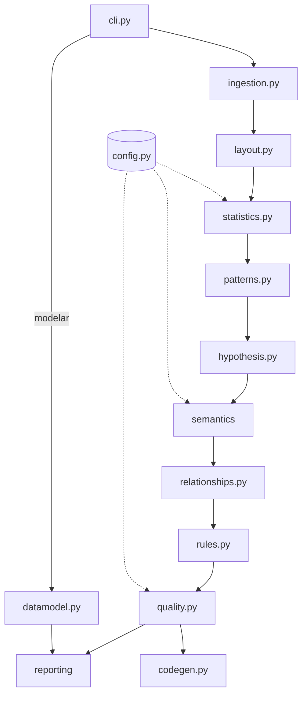

# Recon — Documentação Técnica

Versão 3.0 · Referência de implementação

Este documento descreve **como** o Recon funciona por dentro: módulos,
fluxo de dados, contrato de saída, critérios de cada análise, pontos de
extensão e limitações. Para *o que* ele faz e como usar, veja o `README.md`.
Para *por que* foi desenhado assim, veja
`docs/specs/2026-08-15-recon-v3-design.md`.

---

## 1. Posicionamento

Ferramenta de reconhecimento de dados: roda **antes** da análise, sobre
arquivos que você acabou de receber e não conhece. Não é componente de
pipeline: o comando `historico` compara extrações fornecidas explicitamente,
mas não agenda nem armazena monitoramento contínuo. Não depende de banco de
dados nem de serviço externo.

**Restrições de projeto**, que explicam várias decisões:

- Máquina corporativa sem admin: instalação via `pip install --user`, nada
  que exija compilação fora de wheel publicada.
- Sem banco: o consumo é em pandas sobre arquivo. O código gerado sai em
  pandas primeiro, SQL como alternativa.
- Entrada é planilha, frequentemente montada por pessoa — não export limpo.

---

## 2. Requisitos e instalação

| Item | Valor |
|---|---|
| Python | ≥ 3.12 (piso real de `numpy` 2.5 e `scipy` 1.18) |
| Validado em | 3.14 (registrado em `.python-version`) |
| Dependências | pandas, numpy, pyarrow, openpyxl, xlrd, pyxlsb, charset-normalizer, rapidfuzz, unidecode, scipy, statsmodels, pyyaml, loguru, typer, tqdm |
| Extras `dev` | pytest, pytest-cov, pandas-stubs, types-PyYAML, mypy, ruff |

```bash
pip install -e ".[dev]"          # com venv
pip install --user -e ".[dev]"   # máquina corporativa
```

Todas as versões são fixadas exatamente. É decisão consciente: reprodutível
em máquina restrita vale mais do que receber correções automaticamente.

---

## 3. Mapa de módulos

```
src/recon/
├── config.py            só dado: taxonomias, limiares, dano por defeito, regras de KPI
├── ingestion.py         leitura CSV/XLSX/XLS/XLSB, encoding, separador
├── layout.py            cabeçalho real, linha de total, célula mesclada, blocos
├── patterns.py          documentos, mascaramento, sentinela, mojibake, shape, Benford
├── semantics/           cascata de inferência semântica
│   ├── vocabulary.py      abreviaturas e gazetteers (só dado)
│   ├── tokens.py          normalização, tokenização, expansão de abreviatura
│   ├── detectors.py       cinco detectores determinísticos + contexto
│   └── evidence.py        combinação por noisy-OR, ranking de hipóteses
├── hypothesis.py        testes de hipótese, seleção de distribuição, outliers
├── statistics.py        estatísticas descritivas e qualidade por coluna
├── rules.py             ordem entre datas, nulidade condicional, derivação
├── relationships.py     FD, duplicatas, redundância, correlação, hierarquia, séries
├── datamodel.py         chaves entre tabelas, fato × dimensão, grão, análises
├── quality.py           recomendações, gap analysis, score
├── codegen.py           script de limpeza
├── reporting/           JSON, Markdown, HTML, Parquet, lote, modelo e histórico
├── pipeline.py          DataProfiler — orquestração
├── interativo.py        menu do terminal (`recon` sem argumento)
├── gui.py               janela tkinter (`recon janela`, `Recon.pyw`)
│                        tema escuro (paleta GitHub em `CORES`, tema `clam`),
│                        navegação lateral e seletor de formato
└── cli.py               perfilar · modelar · lote · pasta · conferir · histórico · contrato
```

**Invariantes de arquitetura:**

1. `config.py` é exclusivamente dado. Nenhuma lógica.
2. Todo módulo de análise é um conjunto de funções puras. Sem estado global,
   sem side-effect no import — `logger.add()` só acontece via `setup_logging()`.
3. Módulos e arquivos em inglês técnico; funções, campos e chaves de saída em
   português.
4. Nenhum módulo de análise importa `reporting` ou `cli`.
5. `interativo.py` e `gui.py` são cascas de apresentação sobre `DataProfiler`:
   coletam as mesmas quatro respostas (arquivos, ação, saída, script de
   limpeza) e chamam o pipeline. Regra de análise que aparecer neles está no
   lugar errado — o teste disso é que a CLI, o menu e a janela produzem
   exatamente o mesmo relatório para a mesma entrada.
6. Na `gui.py`, o pipeline roda numa thread de trabalho e só se comunica com a
   interface por uma `queue.Queue` drenada num `after` — o Tk é single-thread,
   e widget tocado de fora da thread da interface trava ou corrompe a janela.
   `processar_arquivo` leva minutos: chamado no callback do botão, congelaria
   a janela em "Não Responde", e o usuário mataria o processo no meio.

---

## 4. Fluxo de dados

### 4.1 Uma tabela (`perfilar`)

```
cli.perfilar
  └─ pipeline.DataProfiler.processar_arquivo
       ├─ ingestion.carregar_arquivo
       │    ├─ detectar_encoding            charset-normalizer
       │    ├─ detectar_separador           consistência de campos por linha
       │    ├─ layout.detectar_linha_cabecalho
       │    ├─ (relê o arquivo com header/skipfooter corretos)
       │    └─ layout.analisar_corpo        total, mesclagem, blocos, colunas vazias
       │
       ├─ processar_dataframe
       │    ├─ FASE 1 — por coluna, independente:
       │    │    statistics.analisar_estatisticas
       │    │      ├─ patterns.detectar_padrao_*          documentos, com DV
       │    │      ├─ patterns.detectar_sentinelas_*
       │    │      ├─ patterns.detectar_inconsistencia_normalizacao
       │    │      ├─ patterns.detectar_mojibake
       │    │      ├─ patterns.detectar_pii_em_texto_livre
       │    │      ├─ hypothesis.calcular_outliers
       │    │      ├─ hypothesis.testar_*                 Shapiro, qui², IC, distribuição
       │    │      └─ sugerir_dtype
       │    │
       │    ├─ FASE 2 — semântica da tabela inteira:
       │    │    semantics.inferir_semanticas_da_tabela   duas passadas
       │    │
       │    ├─ FASE 3 — cruzamentos:
       │    │    relationships.detectar_dependencias_funcionais
       │    │    relationships.analisar_duplicatas / detectar_colunas_redundantes
       │    │    relationships.detectar_chaves_compostas
       │    │    relationships.analisar_correlacoes
       │    │    relationships.detectar_hierarquias / explicar_medidas
       │    │    relationships.analisar_series_temporais
       │    │    rules.inferir_regras
       │    │
       │    └─ FASE 4 — priorização:
       │         quality.gerar_recomendacoes_etl / _tabela
       │         quality.gerar_gap_analysis
       │         quality.calcular_score_qualidade
       │
       └─ reporting.exportar_*  +  codegen.exportar_script_limpeza
```

A semântica roda **depois** da descrição das colunas: os detectores de
conteúdo consomem o que `statistics` já apurou (valores distintos,
cardinalidade, assimetria) em vez de recalcular.

O mesmo fluxo, visual:



### 4.2 Conjunto de tabelas (`modelar`)

Perfila cada tabela (inclusive cada aba de um Excel como tabela independente)
e depois roda `datamodel.analisar_conjunto`: detecta chaves estrangeiras,
classifica papéis, mede grão, integridade referencial e cobertura temporal, e
monta as análises sugeridas com código pronto. Fato × dimensão é
**classificação estrutural, não pelo nome**: tabela que aponta para várias
outras e carrega medida numérica é fato; tabela apontada e com chave própria é
dimensão. Fato sem medida não é anomalia — é tabela de evento, e continua
sendo o centro da análise.

---

## 5. Contrato de saída (JSON)

`schema_version` no payload indica mudanças que quebram consumidor.

### 5.1 Perfil de uma tabela

```jsonc
{
  "metadados_execucao": {
    "tabela": "vendas",
    "timestamp_utc": "...",
    "versao_profiler": "3.0.0",
    "schema_version": "3.0",
    "linhas_originais": 600000,
    "linhas_analisadas": 600000,
    "amostragem_aplicada": false,
    "total_colunas": 50,
    "layout": {
      "linha_cabecalho": 4,
      "linhas_rodape_removidas": 1,
      "colunas_vazias_removidas": ["Unnamed: 7"],
      "avisos": [{"tipo": "...", "severidade": "🔴 ALTA", "mensagem": "..."}]
    },
    "score_qualidade": {
      "score": 86.0, "nota": "B",
      "colunas_comprometidas": 15,
      "colunas_criticas": [{"coluna": "obs", "dano": 1.0, "motivos": [...]}],
      "penalidades": [{"dimensao": "...", "intensidade": 0.16, "pontos_perdidos": 13.6}]
    },
    "duplicatas": {"qtd_linhas_duplicadas": 0, "pct_linhas_duplicadas": 0.0},
    "resumo_qualidade": { /* contagens agregadas */ }
  },
  "colunas": [ { /* ver 5.2 */ } ],
  "recomendacoes_etl":       [{"Prioridade": "🔴 ALTA", "Camada": "Bronze", "Coluna": "...", "Acao": "..."}],
  "dependencias_funcionais": [{"determinante": "...", "dependente": "...", "tipo": "..."}],
  "colunas_redundantes":     [{"coluna": "...", "coluna_redundante": "...",
                              "tipo": "idêntica|quase idêntica", "concordancia": 0.93}],
  "chaves_compostas":        [{"colunas": ["ano", "mes"]}],
  "correlacoes":             [{"coluna_a": "...", "coluna_b": "...", "metrica": "V de Cramér", "valor": 0.91}],
  "hierarquias":             [{"niveis": ["celula", "setor", "diretoria"]}],
  "explicacoes_de_medidas":  [{"medida": "salario", "explicacoes": [{"atributo": "cargo", "eta_quadrado": 0.87}]}],
  "regras_negocio":          [{"tipo": "...", "regra": "...", "conformidade": 0.957, "qtd_violacoes": 5,
                               "exemplos_violacao": [...]}],
  "gap_analysis_kpis":       [{"kpi_id": "...", "status": "✅ Habilitado", "cobertura_pct": "100%"}],
  "analise_temporal_series": [{"coluna": "...", "agregacao": "mensal", "n_pontos": 36, "adf": {...}, "ljung_box": {...}}]
}
```

### 5.2 Registro de coluna

| Campo | Conteúdo |
|---|---|
| `Coluna`, `Tabela_Origem` | identificação |
| `Tipo_Inferred` | `Número Inteiro`, `Número Decimal`, `Texto`, `Texto (⚠️ Parece Data)`, `Data / Hora`, `Booleano`, `Vazio / Sem Tipo Definido` |
| `Semantica_IA`, `Papel`, `Dominio` | os dois eixos da inferência e a semântica primária derivada |
| `Semantica_Score`, `Semantica_Origem` | confiança combinada e a trilha de evidência em texto |
| `Semantica_Conclusiva`, `Semantica_Hipoteses` | se a escolha se destacou, e as alternativas ranqueadas |
| `Qtd_Unicos`, `Ratio_Unicidade`, `Qtd_Nulos`, `Pct_Nulos` | cardinalidade e completude |
| `Caracteristica` | classificação: chave primária, quase-chave, quasi-constante, métrica contínua… |
| `Dado_Sensivel_LGPD` | padrão detectado (`CPF`, `CNPJ`, `E-mail`, `Telefone`, `CEP`, `UUID`, `Nenhum`) |
| `Amostra_Valores` | amostra já mascarada/redigida |
| `Alertas` | `data_como_texto`, `mistura_tipos`, `stats_suprimidas_lgpd` |
| `Qualidade` | `sentinelas`, `inconsistencia_normalizacao`, `mojibake`, `pii_texto_livre`, `documento_invalido`, `nulos_efetivos_*` |
| `Otimizacao` | dtype sugerido e economia estimada em MB |
| `Stats_Extra` | descritivas, outliers, testes de hipótese, perfil de datas, Benford |

### 5.3 Modelo de um conjunto

```jsonc
{
  "metadados_execucao": {"conjunto": "rh", "total_tabelas": 3, "total_relacionamentos": 2},
  "tabelas":            [{"nome": "...", "papel": "Fato", "justificativa": "...",
                          "chaves_primarias": [...], "medidas": [...], "atributos": [...]}],
  "relacionamentos":    [{"tabela_origem": "...", "coluna_origem": "...",
                          "tabela_destino": "...", "coluna_destino": "...",
                          "cardinalidade": "N:1", "contencao": 0.98,
                          "contencao_linhas": 0.92, "pct_orfaos": 0.08,
                          "confianca": 0.95, "tipos_incompativeis": false}],
  "granularidade":      [{"tabela": "...", "colunas": [...], "grao_unico": true}],
  "cobertura_temporal": {"periodos": [...], "tem_intersecao": true},
  "analises_sugeridas": [{"titulo": "...", "pandas": "...", "sql": "..."}],
  "avisos":             [{"severidade": "🔴 ALTA", "tipo": "...", "mensagem": "..."}]
}
```

---

## 6. Critérios de cada análise

### 6.1 Layout de planilha

| Detecção | Critério |
|---|---|
| Linha do cabeçalho | primeira linha com ≥80% da largura modal, ≥60% de células de texto, rótulos distintos e dados abaixo. Busca limitada às 30 primeiras linhas |
| Linha de total | rótulo em `_ROTULOS_TOTAL` **ou** valor numérico dentro de 1% da soma da coluna acima |
| Célula mesclada | ≥30% de nulos, primeira célula preenchida, valores não repetem (distintos/preenchidos ≥ 0,8) e vazios em blocos |
| Blocos múltiplos | linha totalmente vazia com dados antes e depois |
| Coluna de formatação | `Unnamed:` e 100% nula |

Depois de remover o rodapé, colunas que só eram texto por causa dele voltam a
numérico — com ida e volta verificada, para que `00123` nunca vire `123`.

**Todas as heurísticas são conservadoras**: na dúvida, mantêm o comportamento
padrão, e cada ajuste vira aviso explícito no relatório.

### 6.2 Inferência semântica

Dois eixos: **papel** (o que a coluna é) e **domínio** (sobre o que fala).

Cinco detectores determinísticos, do mais forte ao mais fraco:

| # | Detector | Peso base | Resolve |
|---|---|---|---|
| 1 | Conteúdo estruturado validado por DV | 0,98 | `campo1` que só contém CPF |
| 2 | Gazetteer de valores | 0,75–0,95 | `f27` com siglas de UF |
| 3 | Abreviatura por subsequência | 0,35–0,85 | `dpto` ⊂ `departamento` |
| 4 | Dicionário e fuzzy (Jaro-Winkler) | 0,45–0,90 | nome escrito por extenso |
| 5 | Assinatura estrutural | 0,45–0,70 | inteiro único e crescente |

Combinação por **noisy-OR**: `1 - Π(1 - peso)`. Duas pistas de 0,5 valem 0,75.

**Duas passadas**: a segunda usa os domínios estabelecidos com confiança
(≥0,70) para desambiguar o que ficou em aberto. Domínio abaixo de 0,50 não é
afirmado — fica só como hipótese.

**Regra do qualificador de borda**: o token na ponta do nome, quando é um
qualificador conhecido (`id`, `cod`, `dt`, `nome`, `vl`, `code`, `name`,
`iden`, `desc`) que mapeia para uma única categoria, define o papel. As duas
convenções de nomenclatura corporativa põem o qualificador em pontas opostas —
`id_funcionario`, `dt_movimento` no português; `EMPLOYEE_ID`,
`SUPPLIER_CONTACT_CODE` no inglês —, então as duas bordas são olhadas. Quando a
abreviatura da borda é ambígua, a posição resolve: `des` em
`REFUND_TYPE_DES` é `desc`, não `despesa`.

**Precedência do literal sobre o palpite.** Um token que já é palavra do
vocabulário não é expandido como abreviatura (`name` é subsequência de
`nascimento`, e sem essa guarda `FULL_NAME` virava data), e não contribui para
o fuzzy de domínio (`time` é "equipe" em português, e `RECORD_UPDATE_TIME`
ganhava domínio de estrutura organizacional pelo mesmo token que já resolvera
o papel). No fuzzy, o match que é só prefixo da palavra-alvo vale o que cobre
dela — Jaro-Winkler bonifica prefixo de propósito, e `work` casava com
`workshop` a 0,90.

**Refino do papel pelo segundo eixo e pelo conteúdo**, depois que os dois eixos
fecham:

| De | Para | Critério |
|---|---|---|
| Nome / Identificação Pessoal | Rótulo / Nome de Entidade | domínio não é de pessoa (`DEPARTMENT_NAME`) |
| Texto Descritivo Livre | Categoria / Classificação | ≤100 valores distintos e unicidade < 0,50 |

E a característica, que sai só da forma do dado, é corrigida pelo papel: uma
coluna com papel de chave nunca é rotulada "Métrica Contínua" nem "Dimensão
Longa (Texto Livre)" — vira "Código / Identificador". Sem isso, `MANAGER_IDEN`
saía como métrica e convidava a somar matrícula.

### 6.3 Estatística

| Análise | Guarda / critério |
|---|---|
| Shapiro-Wilk | n ≥ 20, série não constante, amostra ≤ 5.000. Acompanha W, assimetria e curtose |
| Qui-quadrado | 2 ≤ categorias ≤ 50, frequência esperada ≥ 5. Acompanha V de Cramér |
| IC 95% da média | n ≥ 2, distribuição t |
| Distribuição provável | seleção por **AIC** entre normal, uniforme, exponencial, lognormal, gama. Distribuições em x>0 ajustadas com `floc=0`. KS reportado como distância descritiva, não decisão |
| Outliers | IQR 1,5 se `\|assimetria\| < 1`; boxplot ajustado por medcouple acima disso |
| ADF / Ljung-Box | série **agregada por período** (diária → semanal → mensal, a primeira com ≥30 pontos). Colunas com característica de chave são excluídas |

### 6.4 LGPD

CPF e CNPJ exigem **dígito verificador**, não só formato. Sem isso, um
timestamp epoch em milissegundos (13 dígitos) era classificado como CNPJ.

Em coluna sensível: amostras mascaradas **e** estatísticas de posição (min,
max, mediana, IC, limites de outlier) suprimidas — o mínimo de uma coluna de
CPF é o CPF de alguém.

Quando o formato bate e o DV não fecha, reporta como documento suspeito em
vez de silenciar.

### 6.5 Relações entre colunas

| Análise | Critério |
|---|---|
| Dependência funcional | cardinalidade < 500; determinante com unicidade < 0,98; verificação O(n) sobre códigos fatorados, com poda por `nunique(det) ≥ nunique(dep)` |
| Bijeção | reportada uma vez como equivalência, não duas FDs |
| Correlação | Pearson/Spearman (num×num), V de Cramér (cat×cat), razão η (cat×num). Limiar 0,7; amostra de 50.000 linhas |
| Chave composta | só quando nenhuma coluna é única sozinha; pares entre as 8 de maior unicidade |
| Hierarquia | encadeamento de FDs com ≥3 níveis |

### 6.6 Chaves entre tabelas

Detecção por **contenção** (`FK ⊆ PK`), não similaridade — a dimensão quase
sempre tem valores que o fato não usa, e Jaccard subestimaria toda relação
real.

| Guarda | Valor |
|---|---|
| Contenção mínima | 0,60 · **0,35** se os nomes coincidem (≥0,75 de similaridade) |
| Confiança mínima | 0,60 = `0,6×contenção + 0,25×similaridade_nome + 0,15×ambos_chave` |
| Cardinalidade mínima da PK | 3 distintos (10 se o nome não apoia) |
| Cobertura mínima da dimensão | 5% (dispensada se o nome apoia) |
| Medida como FK | **proibido** — `carga_horaria` (2 a 40) está contida em qualquer `id` sequencial |

Contenção reportada em dois níveis: por valor distinto (para detectar) e por
linha (para responder "quantos registros eu perco num INNER JOIN?").

### 6.7 Regras de negócio

Reportadas apenas acima de **95% de conformidade** — abaixo disso não é
regra, é coincidência. As violações vêm listadas com exemplos.

| Família | O que descobre |
|---|---|
| Ordem entre datas | `dt_admissao <= dt_desligamento` |
| Nulidade condicional | `dt_desligamento` preenchida ⟺ `status = Inativo` |
| Derivação aritmética | `vl_liquido = vl_bruto - vl_desconto` (uma por trio de colunas) |

### 6.8 Score de qualidade

**Média do dano por coluna**, não soma de frações do total:

```
dano_coluna    = min(1, Σ dano dos defeitos presentes)     # satura em 1
dano_colunas   = média(dano_coluna)
dano_tabela    = min(1, pct_duplicadas + 0,5 × fração_redundante)
score          = 100 × (1 − (0,85 × dano_colunas + 0,15 × dano_tabela))
```

| Defeito | Dano | Defeito | Dano |
|---|---|---|---|
| coluna 100% vazia | 1,00 | PII em texto livre | 0,60 |
| mojibake | 0,80 | inconsistência de grafia | 0,50 |
| documento com DV inválido | 0,80 | data como texto | 0,40 |
| mistura de tipos | 0,70 | dado pessoal estruturado | 0,20 |
| sentinela | 0,60 | nulos | proporcional ao % |

Notas: A ≥ 90, B ≥ 75, C ≥ 60, D ≥ 40, E < 40.

A propriedade que importa é **invariância ao tamanho da tabela**: 30% das
colunas comprometidas custam o mesmo em 10 ou em 200 colunas. A fórmula
anterior dividia cada dimensão pelo total de colunas, e uma base de 70
colunas com 22 problemas de alta prioridade tirava a mesma nota de uma base
limpa.

---

## 7. Pontos de extensão

| Quero… | Onde mexer |
|---|---|
| Adicionar categoria semântica | `config.CATEGORIAS_FORTES` (papel) ou `CATEGORIAS_FUZZY` (domínio) |
| Adicionar abreviatura | `semantics/vocabulary.py` → `ABREVIATURAS` |
| Adicionar conjunto de valores conhecido | `semantics/vocabulary.py` → `GAZETTEERS` |
| Adicionar sentinela | `config.SENTINELAS_TEXTO` / `_NUMERICAS` / `_DATA` |
| Trocar as regras de KPI | YAML via `--kpis`, com `{id, nome, semanticas}` |
| Ajustar sensibilidade | limiares em `config.py` |
| Novo formato de saída | módulo em `reporting/`, exportado no `__init__` |

Regras de KPI em YAML:

```yaml
kpis:
  - id: KPI_FIN_001
    nome: Receita por Região
    semanticas: [Valor Financeiro, Localização Geográfica]
```

---

## 8. Performance medida

Medições reais nesta máquina (Python 3.14, dados simulando extração de
sistema legado, todas as análises ligadas):

| Base | Tempo | Pico de RAM | Fase dominante |
|---|---|---|---|
| 400k × 25 | 11,3 s | 735 MB | colunas (28%) |
| 100k × 70 | 21,7 s | 582 MB | colunas (22%) |
| 600k × 50 | 35,6 s | 1,08 GB | colunas (31%) |
| 600k × 50 amostrado para 200k | 10,5 s | — | — |
| `modelar` com 400k×25 + 100k×70 | 22,7 s | — | — |

Custo aproximado: **RAM ≈ 5–6× o tamanho do CSV**; tempo ≈ linear em linhas ×
colunas. Exportação (JSON, Markdown, HTML, Parquet, script) é desprezível —
menos de 0,1 s no total, com saídas de 0,05 a 0,3 MB.

`limite_amostra` padrão é 2.000.000 de linhas. Amostrar troca correção por
tempo: numa amostra, duplicata e unicidade só podem ser subestimadas, o que
gera "chave primária potencial" que não existe. O payload e os dois
relatórios sinalizam quando houve amostragem.

---

## 9. Testes

```bash
pytest -q                        # 381 testes
pytest --cov=recon           # ~91% de cobertura
ruff check src tests && mypy     # ambos limpos
```

Os testes da janela (`test_gui.py`) se dividem em dois grupos: as regras puras
— resolução da pasta de saída, validação da seleção, tradução de exceção —
rodam em qualquer lugar, e é para poder testá-las sem display que elas ficam
fora da classe `JanelaRecon`. Os que abrem janela de verdade pulam sozinhos
onde não há ambiente gráfico (`pytest.skip`), e cobrem o que só quebra na
integração: o clique devolver o controle na hora, o log do pipeline chegar na
área de mensagens e os controles continuarem alcançáveis em tela baixa.

Organização: um arquivo por módulo, mais `test_cenarios.py` com três
situações de ponta a ponta — base com 60% das linhas contaminadas em várias
dimensões simultâneas; duas tabelas sem chave em comum (o relatório precisa
dizer que não há relação, não inventar uma); e tabela com chave compatível
mas sem nenhuma medida.

Convenção: **cada bug corrigido vira um teste nomeado** cujo docstring
explica o que quebrava e por quê. Metade dos testes de layout verifica a
*não* detecção — heurística que se engana em arquivo bem formado é pior que
não ter heurística.

---

## 10. Limitações conhecidas

| Limitação | Impacto |
|---|---|
| Pesos de confiança não calibrados | os números da cascata semântica vêm de julgamento, não de ajuste sobre corpus rotulado |
| Threshold fuzzy de 0,85 é frouxo | `unica_coluna` casa com `unidade`; com a decisão agora por peso combinado, caberia baixar o piso e deixar o peso proporcional |
| Sem leitura em blocos | arquivo maior que a RAM não é suportado; o arquivo inteiro é lido antes de amostrar |
| Sem paralelização | colunas processadas em série, embora as funções sejam puras |
| Gazetteer de municípios | só as 27 capitais |
| Sentinela textual em CSV | `read_csv` já converte `N/A`, `NA`, `NULL`, `#N/A` em nulo por padrão; o detector agrega valor sobretudo em Excel e para sentinelas fora dessa lista (`-`, `SEM INFORMACAO`, `#N/D`) |
| Sem reaproveitamento entre fases | chamar as fases isoladas e depois o pipeline recomputa tudo; impede uso incremental da API |
| Amostragem e unicidade | numa amostra, unicidade só pode ser subestimada — "chave primária potencial" pode não existir na base completa |

---

## 11. Fora de escopo (decisão explícita)

- Monitoramento de drift entre execuções.
- Geração de asserções para dbt / Great Expectations.
- Qualquer backend de IA (embeddings, LLM local) — foi implementado e
  **removido**: a cascata determinística resolve o caso de uso e a dependência
  não cabe na máquina alvo.
